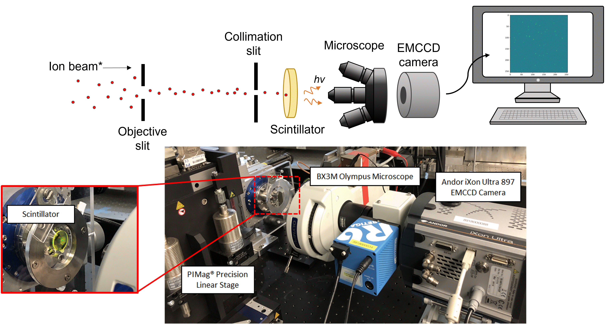
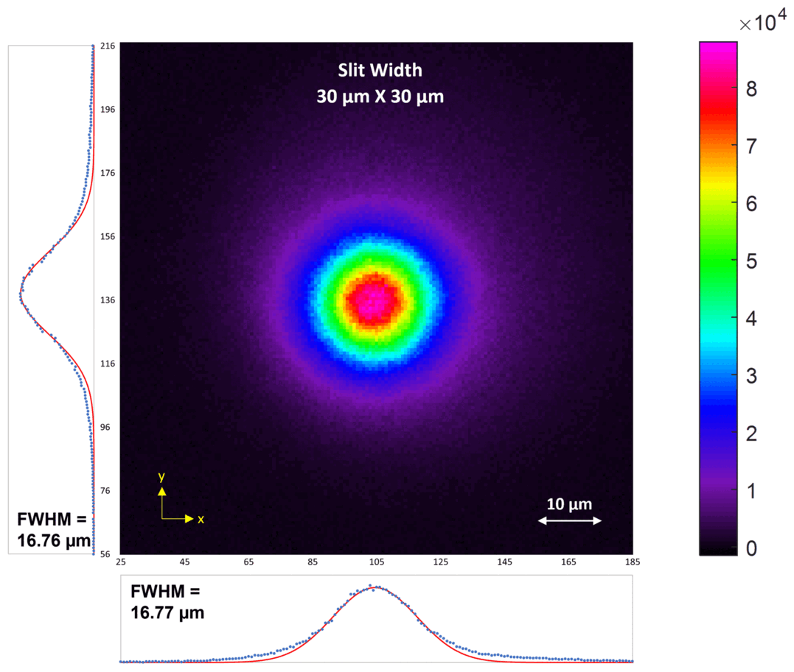
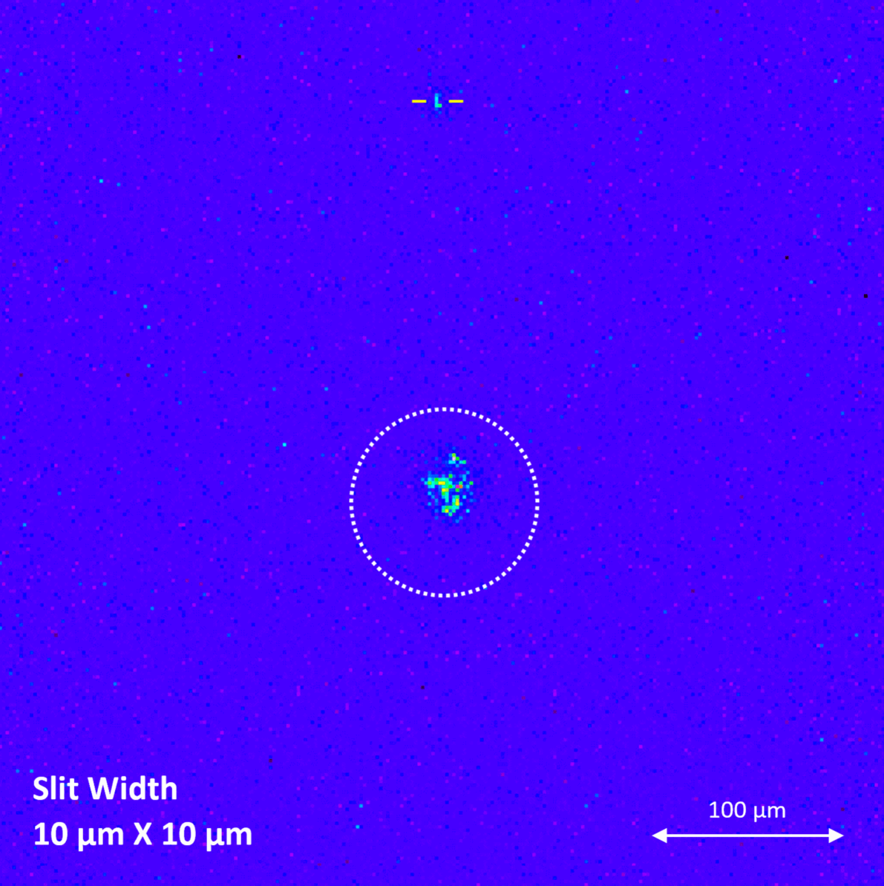
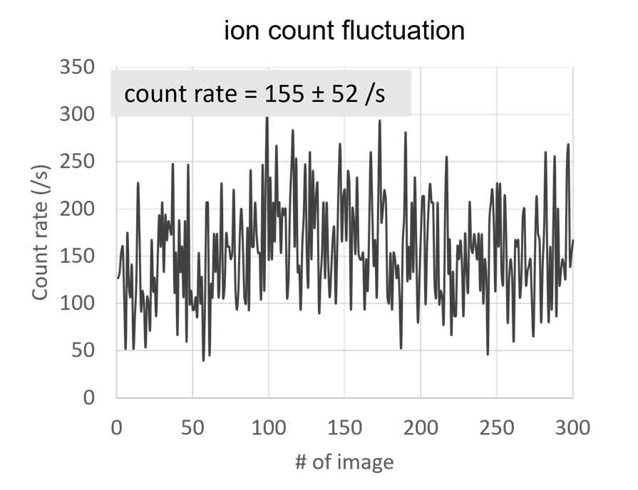
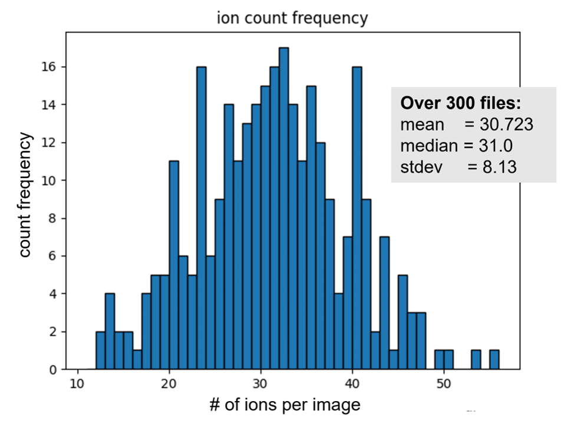

# Appendix

## Motivation
Accurate proton dosimetry is both essential and critical in the field of preclinical proton radiobiology and [proton beam therapy](https://www.mayoclinic.org/tests-procedures/proton-therapy/about/pac-20384758). It is crucial to understand precisely the location and number of incident ions implanted in a target.

This project demonstrates a method for single ion counting by capturing the ion-induced fluorescence of a scintillator with a high-sensitivity EMCCD camera. This is a variation of the conventional [photomultiplier tube (PMT) coupled scinitillator](https://www.sciencedirect.com/topics/engineering/scintillation-detector) method of dosimetry, with the PMT replaced with an EMCCD camera. 

MeV protons were used as an example to illustrate that the method not only precisely counts and returns the locations of single ions, but also offers their lateral spatial distribution (beam size) and percentage of scattered ions for an incident beam of ions, along with additional ion statistics.

## Experimental Setup


## Advantages over conventional ion-counting methods
Commonly used ion-counting methods and their measurements are juxtaposed with the EMCCD imaging method below. 
| Method                                                                                                    | Measurements                                                                                                             |
|:----------------------------------------------------------------------------------------------------------|:-------------------------------------------------------------------------------------------------------------------------|
| [Solid Scintillator-coupled PMT](https://www.sciencedirect.com/topics/engineering/scintillation-detector) | Count rate, Incident beam energy, Real-time analysis                                                                     |
| [Surface Barrier (Silicon, Diamond)](https://www.sciencedirect.com/topics/chemistry/surface-barrier)      | Count rate, Incident beam energy, Real-time analysis                                                                     |
| [Gafchromic<sup>TM</sup> Film](https://pubmed.ncbi.nlm.nih.gov/17153410/)                                 | Spatial beam distribution                                                                                                |
| Our Imaging Method with EMCCD                                                                             | Count rate, Spatial beam distribution, Ion locations, % of large angle scattered ions, Possibility of real-time analysis |

### Additional ion information
The EMCCD imaging method of dosimetry offers ion information that is specific to certain ion detectors, and more.

- **Incident Ion Locations**: The Python ```enumeration``` method and the ```namedtuple``` function from the collections module allows for indexing ```(x, y)``` of all pixels in a 'blob'. As such, locations of incident ions on the scintillator can be easily determined. 

- **Spatial Beam Distrubition (Beam Size Estimate)**: By considering extreme cases (exposing the scintillator to a beam of ions over a long period of time), this allows us to determine the lateral spatial distribution (beam size estimate) of an incident beam of ions by fitting gaussian curves and taking the average of the full width half maxima (FWHM). 
<br><br> 

- **% of Large Angle Scattered Ions**: A circle of radius 50 μm is defined and centred around the beam centre, corresponding to a scattering angle of 10.6°. This radius value encompasses the expected area of incident
ions, with the circle's circumference corresponding to the tail-ends of the fitted gaussian curves. Bright spots that fall outside of this circle are counted as large angle scattered ions as they do not fall within the expected area. A consistent definition allows for consistent comparison against ion-matter simulation software like [SRIM](http://www.srim.org/) and [GEANT4](https://geant4.web.cern.ch/).
The magnitude and extent of ion deflections can give us underlying information on the nature of the accelerator. 
<br><br> 

With the automation of the ion-counting process in ```automateSingleIonCounting.py```, we have the capacity to obtain additional ion statistics: 

- **Ion Count Fluctuation**: The series of fluorescence images obtained over time can be thought of as count rate evolution. This is particularly important in exploring the fluctuation of ion count rate of a pulsed ion beam. This is an ongoing work to explore the use of pulsed ion beam for deterministic ion implantation. 
<br><br> 

- **Ion Count Frequency Distribution**: A histogram with the ion count frequency for a set number of images can be obtained. This is particularly helpful in checking if there are any consistent outliers/abnormalities in the ion-counting procedure. 
<br><br>  

### One-size-fits-all
Owing to the tedious nature of radiobiology experiments, a single dosimetry method that allows for multiple different measurements (count rate, beam size estimate, etc.) will greatly reduce the amount of time needed for the construction and dismantling of seperate ion detectors (e.g. surface barrier detectors for count rates, Gafchromic<sup>TM</sup> films for beam size estimates). One can pay greater focus on the quality of analysis rather than spending time on calibration and equipment setup.

### Same-time incidence
This ion counting method offers the unique advantage of detecting multiple ions arriving simultaneously or within a short interval. Due to its spatial approach of counting ions, the count rate is not limited to the time resolution of a conventional surface barrier detector (which is ~ns). For example, if ≥ 2 ions are incident on a Silicon surface barrier detector at the exact same time, the detector will only register 1 ion. Due to its spatial approach of counting ions, this method can count ≥ 2 ions arriving at the same time, unlike that of the Silicon detector. 
