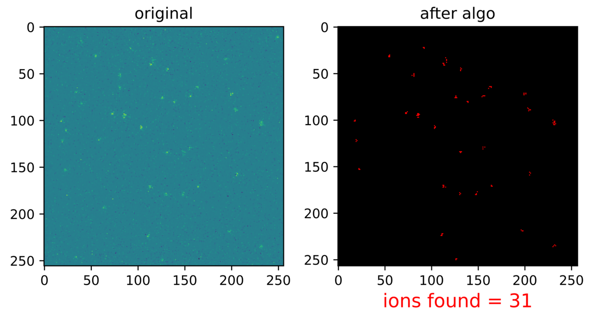

# Single Ion Counting



A repository containing the code(s) used in the Single Ion Counting proton radiobiology undergraduate research project. This is a comprehensive blob segmentation algorithm for the bulk analysis of fluorescence images. The algorithm not only automates the ion-counting process but also returns additional ion statistics. 

For more information on the Single Ion Counting experiment, you may visit the [appendix](https://github.com/jeimzos/SingleIonCounting/blob/master/APPENDIX.md) page. 

## Getting Started

First, get a local copy of the repository.

### Specifying the variables
Before executing the file, the following variables must be specified within the python file(s). 
| Variable           | Description                                                                                       | 
|:-------------------|:--------------------------------------------------------------------------------------------------|
| ```maxCutoff```    | set maximum pixel value cut off to remove (rare) high-intensity noise                             |
| ```nst```          | set noise threshold pixel value to remove background noise                                        |
| ```px```           | set ASCII file pixel resolution (e.g. px=256 implies a 256 by 256 ASCII dataframe file)           |
| ```DCSize```       | set 'blob' size to reject to account for dark current (typically exists as 2-px wide blobs)       |
| ```t```            | set pixel threshold in pixels                                                                     |
| ```colormapDPI```* | set colormap quality (default=100, publishing quality=1200)                                       |   

*Note: Uncomment ```fig.savefig``` under ```plotColormaps()``` to save colormaps in .png format

### Running the file
Next, copy your ASC data files into the 'data' folder and delete the example ASC file. Within your command terminal, navigate to your local repository and execute either

```
python plotIonCountColormaps.py
```
or
```
python automateSingleIonCounting.py
```
For the former, the ```fileName``` must be specified. 

### Which file should I use?
You should always begin with ```plotIonCountColormaps.py```. Here, you can tweak the variables to further improve the ion-counting process and better understand the algorithm's ion-counting process via the colormap visualisation. 

If you would like to iterate over a large number of data files, or you would like to understand the count rate evolution along with other statistics, you should use ```automateSingleIonCounting.py```. Here, there is also the option to save the colormap visualisation for each data file.

## Achievements
The research project in which these codes were featured in was selected as one of the technical oral sessions at the Institute of Physics, Singapore (IPS) 2021 annual scientific conference
meeting under [T17.79 ‘Single Ion Counting via Fluorescence Imaging of Scintillator for Deterministic Ion
Implantation’](https://ipsmeeting.org/download/IPSMeeting2021.pdf#page=81).

## Acknowledgements
This research project would not be possible without the guidance and technical expertise of the wonderful people at [Centre for Ion Beam Applications (CIBA)](https://www.physics.nus.edu.sg/ciba/).
- [Prof. Andrew Bettiol](https://scholar.google.com.sg/citations?user=0TUnUOsAAAAJ&hl), Project Supervisor
- [Dr. Yang Chengyuan](https://scholar.google.com.sg/citations?user=_PM16_kAAAAJ&hl), Research Fellow
- [Dr. Mi Zhaohong](https://scholar.google.com.sg/citations?user=1FSM9U8AAAAJ&hl), Research Fellow


